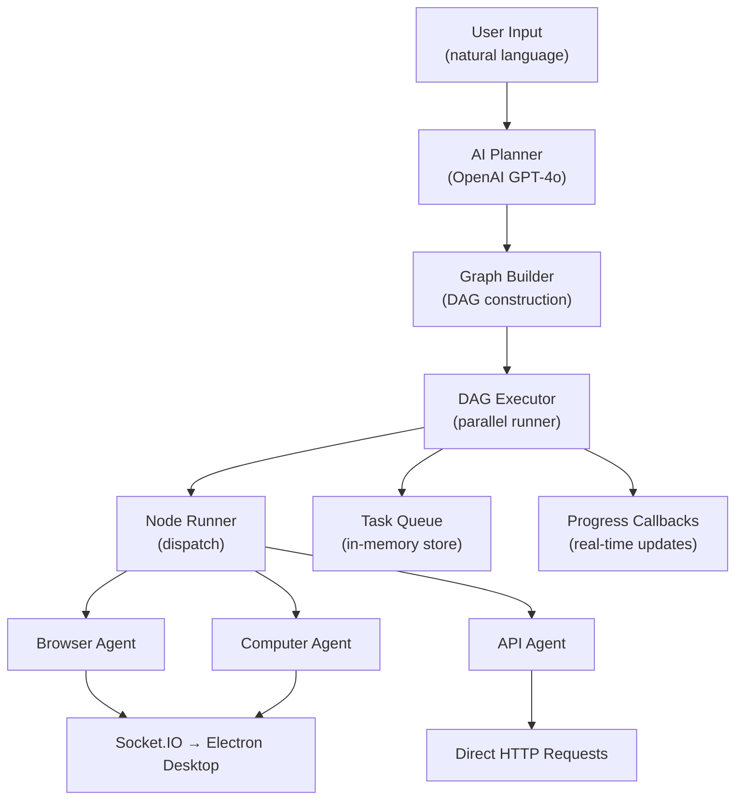

This is a very good architecture direction for **Mac in Wind**. Since your product is basically **“remote AI operator for a real computer”**, your **Task Graph Builder + DAG Executor** is the core differentiator.

I’ll design it specifically for **your stack**:

* Frontend → Next.js
* Backend → Node.js + TypeScript
* Desktop Agent → Electron + RobotJS + AppleScript + native OS APIs
* Real-time → Socket.IO / WebRTC
* AI → OpenAI/Claude planner
* Execution → Browser automation + desktop control + APIs

---

# 1. What DAG means in Mac in Wind

Instead of:

> User says → AI does one thing

You want:

> User says → AI breaks into dependent tasks → Execute tasks in correct order → Retry failed nodes → Stream progress live

Example:

**Voice command**

> “Book me a train ticket from Chennai to Bangalore tomorrow morning and save the PDF in Downloads”

AI should convert into:

```text
Find train website
        │
        ▼
Search trains
        │
        ▼
Select best train
        │
        ▼
Login account
        │
        ▼
Fill passenger details
        │
        ▼
Pay
        │
        ▼
Download PDF ticket
        │
        ▼
Save in Mac Downloads folder
```

This is a DAG.

---

# 2. Architecture for Mac in Wind

```text
iPhone Voice

      │

      ▼

Whisper STT

      │

      ▼

GPT Planner Agent
(decides what needs doing)

      │

      ▼

Task Graph Builder
(convert plan → DAG nodes)

      │

      ▼

DAG Executor Engine
(run dependency graph)

      │

      ▼

Socket.IO/WebRTC

      │

      ▼

Mac Desktop Agent

      │

      ▼

robotjs / AppleScript / Playwright / APIs
```

---

# 3. DAG Structure

Each task is a node.

```ts
type NodeType =
  | "browser"
  | "computer"
  | "api"
  | "decision";

interface TaskNode {
  id: string;

  type: NodeType;

  action: string;

  dependsOn: string[];

  status:
    | "pending"
    | "running"
    | "completed"
    | "failed";

  params?: Record<string, any>;

  retryCount?: number;
}
```

Example:

```ts
[
  {
    id: "1",
    type: "browser",
    action: "open_url",
    params: {
      url: "https://irctc.co.in"
    },
    dependsOn: []
  },

  {
    id: "2",
    type: "browser",
    action: "search_train",
    params: {
      from: "Chennai",
      to: "Bangalore"
    },
    dependsOn: ["1"]
  },

  {
    id: "3",
    type: "computer",
    action: "save_file",
    params: {
      path: "~/Downloads"
    },
    dependsOn: ["2"]
  }
]
```

---

# 4. Folder structure

For Next.js backend:

```text
app/

server/

  ai/

      planner.ts

      graph-builder.ts

      executor.ts

      queue.ts

      node-runner.ts

  agents/

      browser-agent.ts

      computer-agent.ts

      api-agent.ts

  socket/

      desktop-socket.ts
```

---

# 5. Planner Agent

LLM converts user request → JSON plan.

Example prompt:

```ts
const prompt = `
Break user request into tasks.

Return JSON.

Task types:
- browser
- computer
- api
- decision

User:
"${input}"
`;
```

Response:

```json
[
  {
    "action": "open_url",
    "type": "browser"
  },

  {
    "action": "search_product",
    "type": "browser"
  }
]
```

File:

`server/ai/planner.ts`

```ts
export async function planner(input: string) {
  const response = await openai.chat.completions.create({
    model: "gpt-5",
    messages: [
      {
        role: "user",
        content: input
      }
    ]
  });

  return response;
}
```

---

# 6. Task Graph Builder

Convert plan → DAG.

`graph-builder.ts`

```ts
export function buildGraph(tasks: any[]) {
  const nodes = [];

  for (let i = 0; i < tasks.length; i++) {
    nodes.push({
      id: i.toString(),

      action: tasks[i].action,

      type: tasks[i].type,

      dependsOn: i === 0 ? [] : [(i - 1).toString()],

      status: "pending"
    });
  }

  return nodes;
}
```

Output:

```text
Node 1 → Node 2 → Node 3
```

---

# 7. DAG Executor

Executor checks dependencies.

```ts
class DAGExecutor {
  async run(nodes: TaskNode[]) {
    while (true) {
      const readyNodes = nodes.filter(
        (node) =>
          node.status === "pending" &&
          node.dependsOn.every((id) =>
            nodes.find((n) => n.id === id)?.status === "completed"
          )
      );

      if (readyNodes.length === 0) break;

      await Promise.all(
        readyNodes.map((node) => this.executeNode(node))
      );
    }
  }

  async executeNode(node: TaskNode) {
    node.status = "running";

    try {
      await runAgent(node);

      node.status = "completed";
    } catch {
      node.status = "failed";
    }
  }
}
```

---

# 8. Node Runner

Routes task to correct agent.

`node-runner.ts`

```ts
export async function runAgent(node: TaskNode) {
  switch (node.type) {
    case "browser":
      return browserAgent(node);

    case "computer":
      return computerAgent(node);

    case "api":
      return apiAgent(node);

    default:
      throw new Error("unknown agent");
  }
}
```

---

# 9. Browser Agent

Uses Playwright.

```ts
async function browserAgent(node: TaskNode) {
  switch (node.action) {
    case "open_url":
      return await playwright.open(node.params.url);

    case "click":
      return await playwright.click(node.params.selector);

    case "type":
      return await playwright.fill(
        node.params.selector,
        node.params.text
      );
  }
}
```

---

# 10. Computer Agent

Sends command to Mac desktop.

```ts
async function computerAgent(node: TaskNode) {
  await socket.emit("desktop-command", {
    action: node.action,

    params: node.params
  });
}
```

Your Electron app receives:

```ts
ipcMain.handle("execute-command", (_, command) => {
  if (command.action === "mouse_click") {
    robot.mouseClick();
  }

  if (command.action === "open_app") {
    exec(`open -a "${command.params.app}"`);
  }
});
```

---

# 11. Next.js Server Action

```ts
"use server";

import { planner } from "@/server/ai/planner";
import { buildGraph } from "@/server/ai/graph-builder";
import { DAGExecutor } from "@/server/ai/executor";

export async function executeCommand(
  userInput: string
) {
  const plan = await planner(userInput);

  const graph = buildGraph(plan);

  const executor = new DAGExecutor();

  await executor.run(graph);

  return {
    success: true
  };
}
```

---

# 12. Real time progress

Stream progress to frontend.

```ts
socket.emit("task-progress", {
  nodeId: node.id,

  status: "running"
});
```

UI:

```text
✓ Open Chrome

✓ Go to Amazon

⏳ Search Product

Pending: Add to Cart
```

---

# 13. Better graph example (parallel)

User says:

> “Find cheapest MacBook on Amazon and Flipkart and compare”

Graph:

```text
               Start
                  │

        ┌─────────┴─────────┐
        │                   │

        ▼                   ▼

 Search Amazon      Search Flipkart

        │                   │

        └─────────┬─────────┘
                  │

                  ▼

          Compare Prices

                  │

                  ▼

            Show Result
```

JSON:

```ts
[
  {
    id: "1",
    action: "amazon_search",
    dependsOn: []
  },

  {
    id: "2",
    action: "flipkart_search",
    dependsOn: []
  },

  {
    id: "3",
    action: "compare",
    dependsOn: ["1", "2"]
  }
]
```

Executor runs:

```ts
await Promise.all([
  node1,
  node2
]);
```

Parallel execution.

---

# 14. What makes Mac in Wind unique

Most AI agents:

```text
Browser only
```

Your system:

```text
Browser + OS + APIs + Voice + Real computer
```

Can do:

* Open VS Code
* Type code
* Join Zoom meeting
* Speak through microphone
* Control Finder
* Move mouse
* Open Terminal
* Buy product
* Research internet
* Download file
* Edit Excel
* Send emails
* Talk continuously

This is closer to:

* OpenAI Operator
* Claude Computer Use
* Microsoft Copilot Actions

But running on **your own Mac remotely**.

---
 

 # Task DAG System — Walkthrough

## Summary

Implemented the complete **Task DAG (Directed Acyclic Graph) execution engine** for Mac in Wind, following [PLAN.md](file:///Users/bishalkandi/Developer/CODEBASE/electron/macinwind/web/frontend/PLAN.md). The system converts natural-language user commands into structured task graphs that execute in dependency order, with parallel execution where possible.

## Architecture



---

## Files Created / Modified

### New Files (8)

| File | Purpose |
|------|---------|
| [task.ts](file:///Users/bishalkandi/Developer/CODEBASE/electron/macinwind/web/frontend/src/types/task.ts) | Core type definitions: `TaskNode`, `NodeType`, `TaskGraph`, `TaskProgress`, `ExecutionResult` |
| [computer-agent.ts](file:///Users/bishalkandi/Developer/CODEBASE/electron/macinwind/web/frontend/src/server/agents/computer-agent.ts) | OS-level commands: mouse, keyboard, app launching, shell commands |
| [api-agent.ts](file:///Users/bishalkandi/Developer/CODEBASE/electron/macinwind/web/frontend/src/server/agents/api-agent.ts) | Server-side HTTP requests for API-type tasks |
| [desktop-socket.ts](file:///Users/bishalkandi/Developer/CODEBASE/electron/macinwind/web/frontend/src/server/socket/desktop-socket.ts) | Socket.IO wrapper with timeout/ack for desktop communication |
| [route.ts](file:///Users/bishalkandi/Developer/CODEBASE/electron/macinwind/web/frontend/src/app/api/execute-command/route.ts) | `POST /api/execute-command` — orchestrates the full pipeline |

### Modified Files (6)

| File | Change |
|------|--------|
| [planner.ts](file:///Users/bishalkandi/Developer/CODEBASE/electron/macinwind/web/frontend/src/server/ai/planner.ts) | AI planner using GPT-4o with structured JSON output |
| [graph-builder.ts](file:///Users/bishalkandi/Developer/CODEBASE/electron/macinwind/web/frontend/src/server/ai/graph-builder.ts) | DAG construction with cycle detection (Kahn's algorithm) |
| [executor.ts](file:///Users/bishalkandi/Developer/CODEBASE/electron/macinwind/web/frontend/src/server/ai/executor.ts) | Parallel DAG executor with retry logic and progress callbacks |
| [node-runner.ts](file:///Users/bishalkandi/Developer/CODEBASE/electron/macinwind/web/frontend/src/server/ai/node-runner.ts) | Central dispatch routing nodes to agents by type |
| [queue.ts](file:///Users/bishalkandi/Developer/CODEBASE/electron/macinwind/web/frontend/src/server/ai/queue.ts) | In-memory task queue tracking execution state |
| [browser-agent.ts](file:///Users/bishalkandi/Developer/CODEBASE/electron/macinwind/web/frontend/src/server/agents/browser-agent.ts) | Browser automation commands relayed via Socket.IO |
| [.env](file:///Users/bishalkandi/Developer/CODEBASE/electron/macinwind/web/frontend/.env) | Added `OPENAI_API_KEY` placeholder |

### Dependency Added

- `openai` — OpenAI Node.js SDK for the AI planner

---

## Key Design Decisions

1. **Agents relay via Socket.IO** — Browser and computer agents don't run Playwright/RobotJS directly. They send structured commands to the Electron desktop app, which handles the actual execution.

2. **Parallel execution** — The DAG executor runs independent nodes concurrently via `Promise.all()`, only blocking on nodes with unmet dependencies.

3. **Retry with back-off** — Failed nodes retry up to 2 times (configurable) with exponential back-off (1s → 5s max).

4. **Fail-fast** — When any node fails permanently, downstream nodes are marked as blocked immediately.

5. **Cycle detection** — Kahn's algorithm validates the graph before execution to prevent infinite loops.

6. **Decision nodes** — Currently pass-through; can be extended to re-invoke the LLM for runtime conditional logic.

---

## Verification

- **TypeScript compilation**: `npx tsc --noEmit` — **0 new errors** from DAG system files. All errors are pre-existing in other components.

## Next Steps

- Replace `OPENAI_API_KEY=your_openai_api_key_here` in `.env` with a real key
- Add a frontend task progress panel to display real-time execution updates
- Handle the `browser:*` and `computer:*` commands on the Electron desktop agent side
- Consider adding a status polling endpoint (`GET /api/execute-command/[executionId]`)
